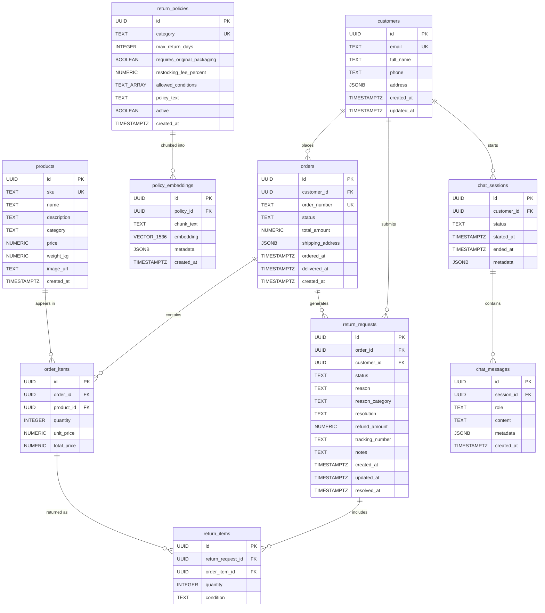

```mermaid
erDiagram
    customers {
        UUID id PK
        TEXT email UK
        TEXT full_name
        TEXT phone
        JSONB address
        TIMESTAMPTZ created_at
        TIMESTAMPTZ updated_at
    }

    products {
        UUID id PK
        TEXT sku UK
        TEXT name
        TEXT description
        TEXT category
        NUMERIC price
        NUMERIC weight_kg
        TEXT image_url
        TIMESTAMPTZ created_at
    }

    orders {
        UUID id PK
        UUID customer_id FK
        TEXT order_number UK
        TEXT status
        NUMERIC total_amount
        JSONB shipping_address
        TIMESTAMPTZ ordered_at
        TIMESTAMPTZ delivered_at
        TIMESTAMPTZ created_at
    }

    order_items {
        UUID id PK
        UUID order_id FK
        UUID product_id FK
        INTEGER quantity
        NUMERIC unit_price
        NUMERIC total_price
    }

    return_requests {
        UUID id PK
        UUID order_id FK
        UUID customer_id FK
        TEXT status
        TEXT reason
        TEXT reason_category
        TEXT resolution
        NUMERIC refund_amount
        TEXT tracking_number
        TEXT notes
        TIMESTAMPTZ created_at
        TIMESTAMPTZ updated_at
        TIMESTAMPTZ resolved_at
    }

    return_items {
        UUID id PK
        UUID return_request_id FK
        UUID order_item_id FK
        INTEGER quantity
        TEXT condition
    }

    return_policies {
        UUID id PK
        TEXT category UK
        INTEGER max_return_days
        BOOLEAN requires_original_packaging
        NUMERIC restocking_fee_percent
        TEXT_ARRAY allowed_conditions
        TEXT policy_text
        BOOLEAN active
        TIMESTAMPTZ created_at
    }

    policy_embeddings {
        UUID id PK
        UUID policy_id FK
        TEXT chunk_text
        VECTOR_1536 embedding
        JSONB metadata
        TIMESTAMPTZ created_at
    }

    chat_sessions {
        UUID id PK
        UUID customer_id FK
        TEXT status
        TIMESTAMPTZ started_at
        TIMESTAMPTZ ended_at
        JSONB metadata
    }

    chat_messages {
        UUID id PK
        UUID session_id FK
        TEXT role
        TEXT content
        JSONB metadata
        TIMESTAMPTZ created_at
    }

    customers ||--o{ orders : "places"
    customers ||--o{ return_requests : "submits"
    customers ||--o{ chat_sessions : "starts"

    orders ||--o{ order_items : "contains"
    orders ||--o{ return_requests : "generates"

    products ||--o{ order_items : "appears in"

    order_items ||--o{ return_items : "returned as"

    return_requests ||--o{ return_items : "includes"

    return_policies ||--o{ policy_embeddings : "chunked into"

    chat_sessions ||--o{ chat_messages : "contains"
```
